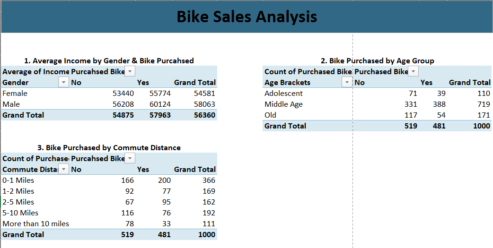
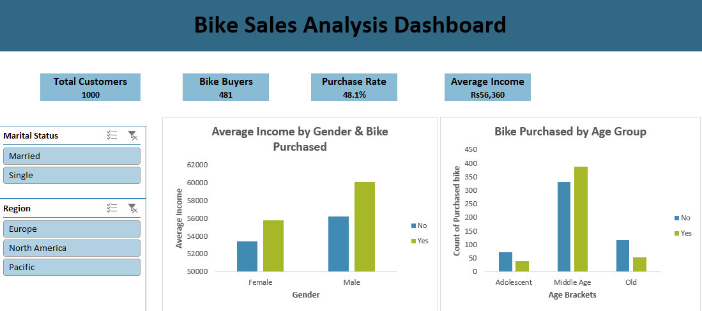
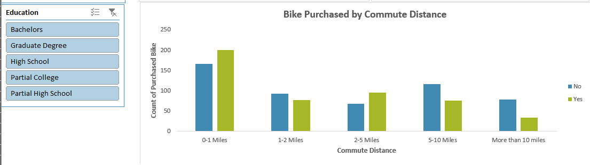

#  Bike Sales Analysis

##  Project Overview

This project analyzes bike sales data using **Microsoft Excel** to identify purchasing patterns and understand how customer demographics and commute-related factors relate to bike purchases.

The project includes data preparation, analysis using PivotTables, and an interactive dashboard to present key findings in a clear and visual format.

## Project Objective

The main objectives of this project were to:

* Analyze customer purchasing behavior
* Compare bike purchases across different age groups
* Analyze bike purchases by gender
* Examine the relationship between commute distance and bike purchases
* Compare average income between customers who purchased and did not purchase a bike
* Create clear visualizations and a dashboard for presenting insights

## Tools & Technologies

* **Microsoft Excel**
* Excel Formulas
* Data Cleaning
* PivotTables
* PivotCharts
* Data Visualization
* Dashboard Design

##  Analysis Performed

The analysis focuses on several important aspects of the dataset:

### 1. Customer Demographics

Analyzed customer information such as:

* Gender
* Age
* Age Group
* Income

### 2. Bike Purchase Analysis

Examined:

* Customers who purchased a bike
* Customers who did not purchase a bike
* Purchase rate
* Bike purchases across different customer segments

### 3. Income Analysis

Compared average income based on:

* Gender
* Bike purchase status

### 4. Age Group Analysis

Analyzed bike purchases across different age groups to identify which customer segments showed higher purchasing activity.

### 5. Commute Distance Analysis

Examined bike purchases according to customers' commute distance.

##  Dashboard

The final Excel dashboard presents the analysis through:

* KPI cards
* Charts
* Purchase-rate analysis
* Customer segmentation
* Visual comparisons

The dashboard was designed to make the main findings easier to understand at a glance.

##  Key Insights

Some of the key findings from the analysis include:

* The dataset contains **1,000 customer records**.
* **481 customers purchased a bike**, resulting in an overall purchase rate of **48.1%**.
* Bike purchasing behavior varies across different age groups.
* Customer income differs between bike purchasers and non-purchasers.
* Commute distance provides another useful dimension for understanding purchasing behavior.
* Customer demographics can help identify segments with stronger bike-purchasing activity.

##  Project Files

| File                       | Description                                                                       |
| -------------------------- | --------------------------------------------------------------------------------- |
| `Bike_Sales_Analysis.xlsx` | Complete Excel workbook containing the data, analysis, PivotTables, and dashboard |
| `Analysis.png`             | Screenshot of the analysis section                                                |
| `Dashboard.png`            | Screenshot of the final dashboard                                                 |

##  Project Preview

### Analysis

### Dashboard

## Skills Demonstrated

This project demonstrates practical skills in:

* Data Cleaning
* Excel Formulas
* PivotTables
* PivotCharts
* Data Analysis
* Data Visualization
* Dashboard Creation
* Business-oriented Data Interpretation

##  Author

**Aleeza Habib**

Software Engineering Student | Aspiring Data Analyst

GitHub: [Aleeza Habib](https://github.com/aleezahabib33)
